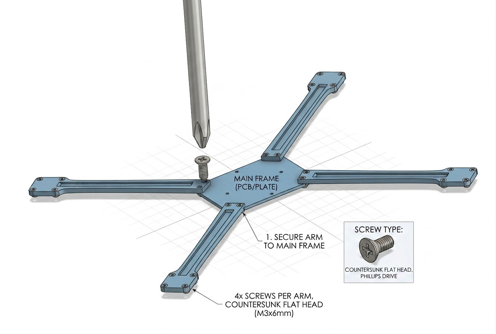
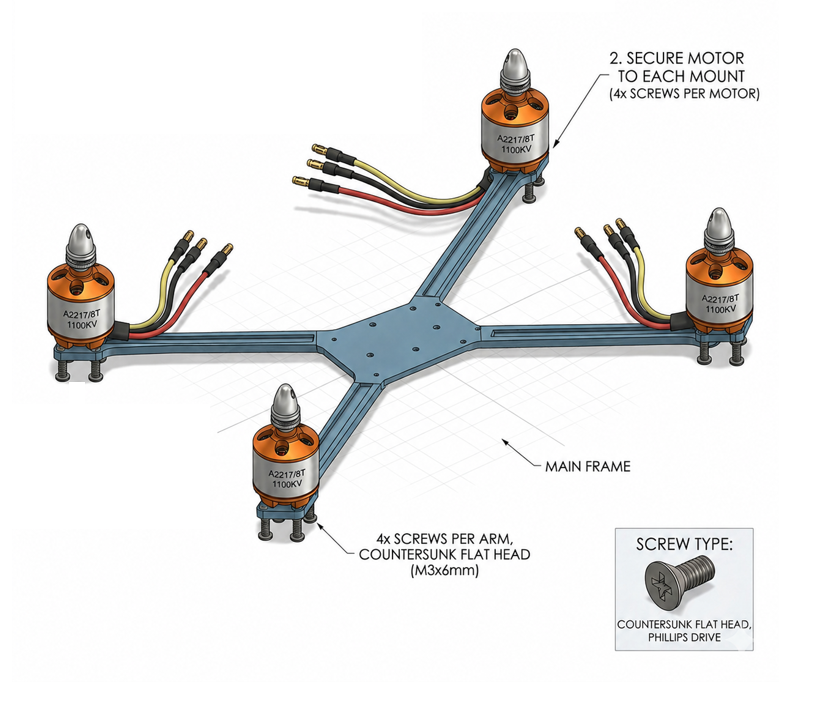
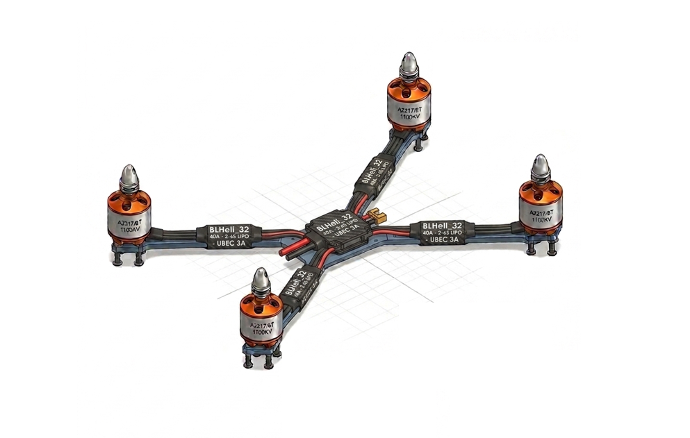

# Drone Specifications

| Component | Specification |
|---|---|
| Drone Type | Quadcopter |
| Frame | Custom 3D Printed |
| Flight Controller | Pixhawk / ESP32 |
| Motors | Brushless Motors |
| ESC | 30A ESC |
| Battery | 4S LiPo |
| Propellers | 1045 |
| Telemetry | WiFi / RF |

---

# Repository Structure

```bash
cocodrone/
│
├── docs/
├── firmware/
├── hardware/
├── 3d-models/
├── tools/
├── simulations/
├── images/
└── website/
```

---

# 3D Models

All CAD parts are designed in Onshape.

| Part | Link |
|---|---|
| Main Frame | [Open Onshape](https://cad.onshape.com/documents/54fa76160bd66b7388fa65d6/w/6e7a73166f90c9725974488a/e/fc4c085d508c0ff7ded88681?renderMode=0&uiState=69fc1c2754959f6677036b69) |
| Motor Mount | [Open Onshape](https://cad.onshape.com/documents/54fa76160bd66b7388fa65d6/w/6e7a73166f90c9725974488a/e/9363f12c0c475fe9cfaab996?renderMode=0&uiState=69fc1c7954959f6677036eb3) |
| Main Board Frame | [Open Onshape](https://cad.onshape.com/documents/54fa76160bd66b7388fa65d6/w/6e7a73166f90c9725974488a/e/ff90d93fdcff8df0d0dc7dd0?renderMode=0&uiState=69fc1cc254959f6677036f7e) |
| Camera Mount | [Open Onshape](https://cad.onshape.com/documents/YOUR_LINK_HERE) |
| Battery Holder | [Open Onshape](https://cad.onshape.com/documents/YOUR_LINK_HERE) |

---

# Download Files

## STL Files

Located inside:

```bash
/3d-models/stl
```

## STEP Files

Located inside:

```bash
/3d-models/step
```

# Assemble Guide

## 1. Main Frame

Connect the 4 legs to the main frame using a screw.




## 2. Motor Mount

Mount Motor at the end part of the legs also using the screw.



## 3. Adding ESC

Connect Esc to each motor, 2 motor must rotate clockwise then the other 2 must roate counter-clockwise. After connecting the motors to the ESC connect the ESC to the power distribution Board.

