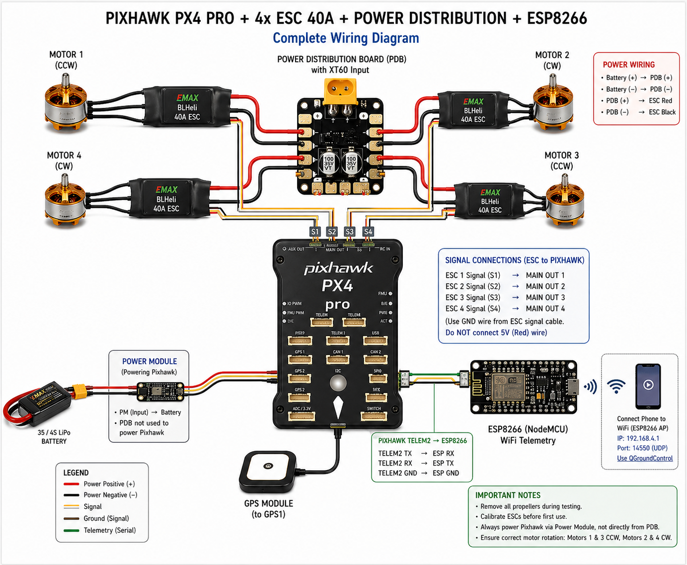
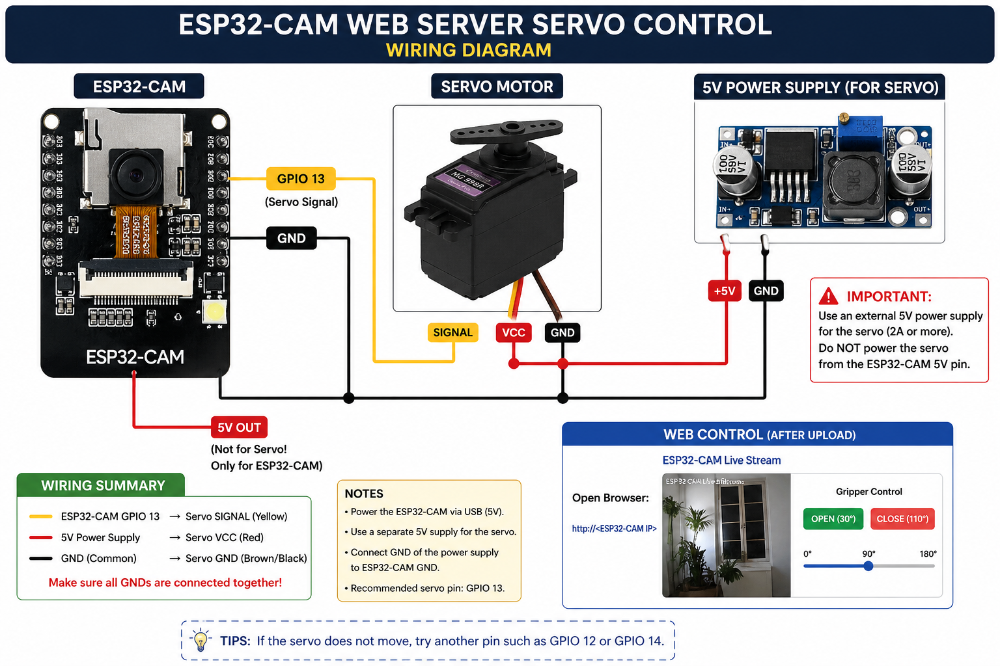

# Electronics Overview

```text
Battery
   ↓
XT60 Connector
   ↓
Power Distribution Board
   ↓
ESCs
   ↓
Brushless Motors
```

Flight controller handles:

- Motor control
- Sensor processing
- Stabilization
- GPS navigation
- Telemetry communication

---
# Wiring Guide

## Main Wiring Diagram



## Gripper Wiring Diagram
